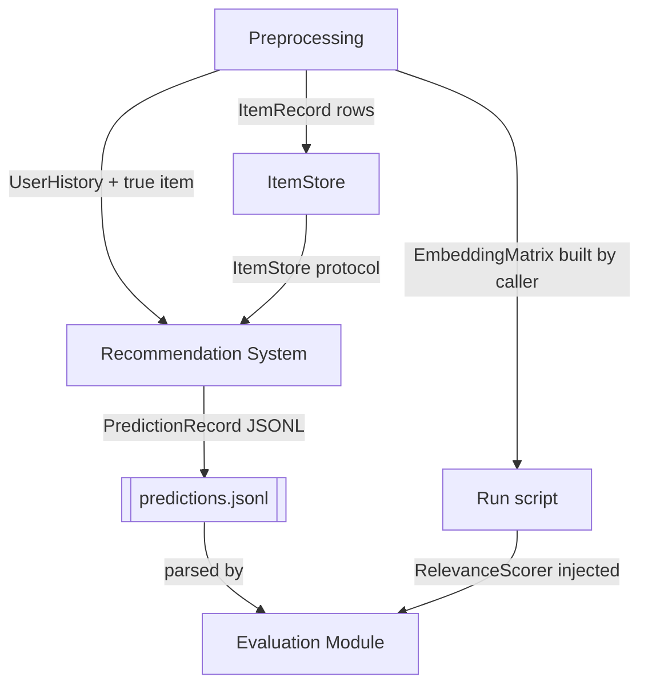

# Interfaces and Data Contracts

This is the single source of truth for every structure and protocol that crosses a component boundary. The other documents in this directory reference these names instead of redefining them. If a shape is not described here, it is private to one component and no other component may depend on it.

Signatures are Python 3.13 with `typing.Protocol`. They describe contracts; the implementations live under `src/`.

## Contents

- [Identifier conventions](#identifier-conventions)
- [Data structures](#data-structures)
  - [ItemRecord](#itemrecord)
  - [UserHistory](#userhistory)
  - [ScoredItem](#scoreditem)
  - [PredictionRecord and the predictions file](#predictionrecord-and-the-predictions-file)
  - [EmbeddingMatrix](#embeddingmatrix)
- [Protocols](#protocols)
  - [ItemStore](#itemstore)
  - [UserProfileBuilder](#userprofilebuilder)
  - [CandidateRetriever](#candidateretriever)
  - [Ranker](#ranker)
  - [RelevanceScorer](#relevancescorer)
- [Who depends on what](#who-depends-on-what)

## Identifier conventions

| Name | Type | Meaning |
| --- | --- | --- |
| `item_id` | `str` | Canonical item key. Always `parent_asin`, never the variant `asin`. |
| `user_id` | `str` | Pseudonymous user key exactly as it appears in the source data. |
| `run_id` | `str` | Identifies one prediction run. Used in artifact filenames and in the run manifest. |
| `K` | `int` | Length of the returned ranked list. Default `10`. |

Identifiers are opaque strings everywhere they cross a boundary. Integer index maps may exist inside a component for model efficiency, but they must never appear in a `PredictionRecord` or in any argument to the evaluation module. This is what lets the evaluator score a predictions file produced by unrelated code.

## Data structures

### ItemRecord

What the item store returns for a single item.

```python
@dataclass(frozen=True, slots=True)
class ItemRecord:
    item_id: str                 # parent_asin
    description_text: str        # assembled, normalized; see preprocessing.md
    embedding: np.ndarray | None # float32, shape (d,), L2-normalized; None if not requested
```

`description_text` is the *already assembled* text. Consumers never re-assemble it from raw metadata fields; assembly happens once in preprocessing so the system and the evaluator can never disagree about what an item's description is.

`embedding` is `None` only when the caller explicitly asked for records without vectors. When present it is L2-normalized, so cosine similarity is a plain dot product.

### UserHistory

The system's view of one user before prediction.

```python
@dataclass(frozen=True, slots=True)
class UserHistory:
    user_id: str
    item_ids: tuple[str, ...]    # chronological, oldest first
    timestamps_ms: tuple[int, ...]  # parallel to item_ids
```

Invariants:

- Contains **training** interactions only. The held-out true item is never present. A history containing the true item is a leakage bug and the system should fail loudly rather than continue.
- `item_ids` is non-empty and strictly chronologically ordered, ties broken deterministically.
- `len(item_ids) == len(timestamps_ms)`.

### ScoredItem

Internal to the system, passed between `CandidateRetriever` and `Ranker`.

```python
@dataclass(frozen=True, slots=True)
class ScoredItem:
    item_id: str
    score: float    # higher means more likely; no fixed range
```

Scores are comparable only within one user's list. Nothing downstream may compare a score across users or interpret it as a probability.

### PredictionRecord and the predictions file

This is the seam between the two halves of the project, and the only structure both sides know about.

```python
@dataclass(frozen=True, slots=True)
class PredictionRecord:
    user_id: str
    true_item_id: str
    predicted_item_ids: tuple[str, ...]   # ranked, most likely first
```

On disk it is **JSON Lines**: one JSON object per line, one line per evaluated user, UTF-8, LF line endings.

```jsonl
{"user_id": "AE22236AFRRSMQIKGG7TPTB75QEA", "true_item_id": "B08BBQ29N5", "predicted_item_ids": ["B07XYZ1234", "B09ABC5678", "B0812345XY"]}
{"user_id": "AGKHLEW2SOWHNMFQIJGBECAF7INQ", "true_item_id": "B07ZZZ0001", "predicted_item_ids": ["B07ZZZ0001", "B0844444AA", "B06YY99887"]}
```

Contract:

| Rule | Rationale |
| --- | --- |
| Exactly one line per evaluated user; `user_id` is unique across the file. | The evaluator aggregates per user and must not double count. |
| `predicted_item_ids` is ordered most likely first. | Rank position drives both the DCG discount and the top-1 check. |
| `predicted_item_ids` contains no duplicates. | A repeated item would be double-counted in DCG. |
| `predicted_item_ids` excludes every item already in the user's history. | Recommending a past purchase is not a prediction of the next one. |
| `true_item_id` is never included by construction — only by the ranker genuinely ranking it. | Otherwise the metrics are meaningless. |
| Length may be shorter than `K` but must be at least 1. | A ranker may run out of eligible candidates; the evaluator handles short lists explicitly. |
| No scores are written. | Scores are not comparable across runs and the metrics do not use them. |

The file is written to `artifacts/predictions/<run_id>.jsonl`. An accompanying `artifacts/predictions/<run_id>.manifest.json` records the run parameters; see [preprocessing.md](preprocessing.md#pr9-run-manifest).

Optional extra keys are permitted on a line and must be ignored by readers. This keeps the format forward-compatible; a run may add a `debug` key without breaking the evaluator.

### EmbeddingMatrix

How embeddings reach the evaluation module. The caller builds this; the evaluator never constructs one from a data source.

```python
@dataclass(frozen=True, slots=True)
class EmbeddingMatrix:
    item_ids: Sequence[str]   # row i corresponds to item_ids[i]
    vectors: np.ndarray       # float32, shape (n_items, d), L2-normalized
```

Invariants: `len(item_ids) == vectors.shape[0]`, `item_ids` has no duplicates, every row has unit L2 norm. The evaluator builds an `item_id -> row` index once at construction and treats the matrix as read-only.

## Protocols

### ItemStore

Implemented by the item store, consumed by the system. Full behavior in [item-store.md](item-store.md).

```python
class ItemStore(Protocol):
    def get(self, item_id: str, *, with_embedding: bool = True) -> ItemRecord | None: ...

    def get_many(
        self, item_ids: Sequence[str], *, with_embedding: bool = True
    ) -> list[ItemRecord]: ...

    def embeddings_for(self, item_ids: Sequence[str]) -> np.ndarray: ...

    def search(
        self,
        query: np.ndarray,
        *,
        top_n: int,
        exclude_item_ids: Collection[str] = (),
    ) -> list[ScoredItem]: ...

    def all_item_ids(self) -> Sequence[str]: ...

    def __len__(self) -> int: ...
```

`get` returns `None` for an unknown id; `get_many` skips unknown ids and returns fewer records than requested rather than raising, so callers must check length when coverage matters. `embeddings_for` raises `KeyError` on an unknown id, because a missing vector there is always a bug.

### UserProfileBuilder

```python
class UserProfileBuilder(Protocol):
    def build(self, history: UserHistory) -> np.ndarray: ...
```

Turns a purchase history into a single query vector in the same embedding space as the item vectors. Returns a float32 array of shape `(d,)`, L2-normalized. Raises `ValueError` for an empty history.

### CandidateRetriever

```python
class CandidateRetriever(Protocol):
    def retrieve(
        self, history: UserHistory, profile: np.ndarray, *, top_n: int
    ) -> list[ScoredItem]: ...
```

Narrows the catalog to `top_n` plausible items for this user, already excluding the user's history. `top_n >= K`; a retriever that returns fewer than `K` items forces a short prediction list, which is legal but should be logged.

### Ranker

```python
class Ranker(Protocol):
    def rank(
        self, history: UserHistory, candidates: Sequence[ScoredItem], *, k: int
    ) -> list[str]: ...
```

Produces the final ordered `item_id` list of length at most `k`. The output of `rank` is what goes into `PredictionRecord.predicted_item_ids`.

### RelevanceScorer

The only injection point of the evaluation module. Full behavior in [evaluation.md](evaluation.md).

```python
class RelevanceScorer(Protocol):
    def score(
        self, true_item_id: str, predicted_item_ids: Sequence[str]
    ) -> Sequence[float]: ...
```

Returns one relevance value per predicted item, in the same order, each in `[0.0, 1.0]`. The returned sequence must have the same length as `predicted_item_ids`.

The default implementation, `CosineEmbeddingScorer`, is constructed from an `EmbeddingMatrix`:

```python
scorer = CosineEmbeddingScorer(matrix, on_missing="raise")
```

It computes cosine similarity between the true item's vector and each predicted item's vector and clamps negatives to `0.0` so discounted gains stay non-negative. `on_missing` selects behavior for an id absent from the matrix: `"raise"` (default, recommended for real runs) or `"zero"` (treat as relevance `0.0`, for exploratory work).

Because this is a protocol, a lexical-overlap scorer, a category-match scorer, or a stub returning constants can be substituted without touching any metric code. Tests use a stub.

## Who depends on what



Note that no arrow runs from the system to the evaluation module. The run script that orchestrates a full experiment may import both, but neither imports the other.
