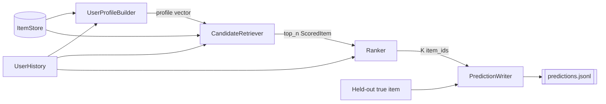

# Recommendation System

Given a user's past purchases, return a list of items ranked from most to least likely to be the next purchase. Relevance comes from how well item descriptions match the descriptions of what the user already bought. The candidate universe is every item in the [item store](item-store.md).

## Pipeline



Four components, each replaceable behind its protocol. The two-stage shape (retrieve a shortlist, then rank it carefully) exists so the expensive scoring only runs on a few hundred items instead of the whole catalog. At the current catalog size you could skip retrieval and score everything exactly; the split is kept because it is what lets the system stay fast as the catalog grows and because it makes "what did the ranker choose from" an inspectable artifact.

The held-out true item enters only at the writer, and only to be copied into the output record. No component upstream of the writer ever sees it.

---

## UserProfileBuilder

**Responsibility.** Turn a purchase history into one query vector living in the same embedding space as the item vectors. This vector is the system's answer to "what kind of thing does this user buy?"

**Implements.** [`UserProfileBuilder`](interfaces.md#userprofilebuilder)

```python
def build(self, history: UserHistory) -> np.ndarray: ...
```

**Inputs.** A `UserHistory` (training interactions only, chronological) and the item store, from which it fetches `embeddings_for(history.item_ids)`.

**Outputs.** A float32 array of shape `(d,)`, L2-normalized so downstream cosine similarity is a dot product.

**Guidelines.**

- Start with the mean of the history item vectors, then renormalize. It is the obvious baseline and it is genuinely hard to beat with a small history.
- Recency weighting is the first thing worth trying beyond the mean: weight item `j` by an exponential decay on its age, since a purchase from three years ago says less about the next one than last month's. Make the decay rate a configured parameter, not a constant buried in the code, so it can be tuned on validation and recorded in the manifest.
- Keep the builder stateless. Everything it needs arrives in the arguments, which makes it trivially testable and safe to parallelize across users.
- A single-item history is legal and should produce that item's vector unchanged.

**Must not.** Fetch vectors from anywhere but the store. Look at ratings to filter — the history handed to it is already filtered to positives by the split. Mutate the arrays the store returns; copy before scaling.

**Failure modes.** An empty history raises `ValueError` rather than returning a zero vector, because a zero vector produces an arbitrary but confident-looking ranking. A history where every item is missing from the store surfaces as `KeyError` from `embeddings_for`, which is the correct loud failure.

---

## CandidateRetriever

**Responsibility.** Narrow the catalog to `top_n` plausible items for this user, already excluding everything they have interacted with.

**Implements.** [`CandidateRetriever`](interfaces.md#candidateretriever)

```python
def retrieve(self, history: UserHistory, profile: np.ndarray, *, top_n: int) -> list[ScoredItem]: ...
```

**Inputs.** The history, the profile vector, and the store.

**Outputs.** Up to `top_n` `ScoredItem`, descending by score. Scores here are provisional; the ranker is free to reorder completely.

**Guidelines.**

- The default retrieval is a single `store.search(profile, top_n=n, exclude_item_ids=mask)`. One vector query per user, and the store does the filtering.
- A useful second strategy is per-history-item retrieval: search neighbors of each item the user bought, then union the results. This surfaces items similar to one specific past purchase, which a mean profile can average away — the user who bought nine guitar accessories and one clarinet reed still might buy another reed. If both strategies are used, take the union and let the ranker sort it out.
- `top_n` must be comfortably larger than `K`, since exclusions and deduplication shrink the list. A few hundred for `K = 10` is a reasonable starting point.
- Pass the exclusion set **into** the store rather than filtering the results afterwards, or the returned list quietly comes back short.
- Returning fewer than `K` candidates is legal but should be logged with the user id; it means the mask consumed most of the catalog.

**Must not.** Include any item from the user's mask set (PR7 in [preprocessing.md](preprocessing.md#pr7-per-user-mask-set)). Include duplicates when unioning strategies. Reach outside the store for candidates — the store defines what exists.

**Failure modes.** A silently truncated list caused by post-hoc filtering is the common one; over-fetch by the exclusion size. Approximate index recall is the other: HNSW may miss a true nearest neighbor, so measure recall against exact search once at the chosen `top_n` and pick parameters from that measurement rather than from defaults.

---

## Ranker

**Responsibility.** Produce the final ordered list of at most `K` item ids from the candidate shortlist. This ordering is the system's actual prediction and is exactly what the metrics consume.

**Implements.** [`Ranker`](interfaces.md#ranker)

```python
def rank(self, history: UserHistory, candidates: Sequence[ScoredItem], *, k: int) -> list[str]: ...
```

**Inputs.** The history, the candidates, and the store for exact vectors.

**Outputs.** A list of at most `k` unique `item_id`, most likely first.

**Guidelines.**

- Rescore exactly. Retrieval may have used an approximate index; ranking should use exact cosine similarity on the candidate vectors, which costs nothing at shortlist size.
- Maximum similarity to any single history item is a stronger signal than similarity to the averaged profile, and combining the two (a weighted sum of profile similarity and max-history similarity) is the natural first improvement. Any weights must be tuned on the validation split, never on the held-out test item.
- Ties must break deterministically, by item id. Nondeterministic tie-breaking makes runs irreproducible and quietly changes top-1 exact match, which is decided by a single position.
- Enforce the output invariants here, at the last point where the list is still in memory: unique ids, no history items, length at most `k`. The writer validates, but the ranker is what fixes.

**Must not.** Look at the held-out true item under any circumstance — not to score, not to filter, not to log. This is the leakage boundary of the whole project. Use future information of any kind, including the rating the user eventually gave. Read `average_rating` or `rating_number`, which are excluded from item text for the same reason (see [table_schema.md](../../table_schema.md)).

**Failure modes.** Position bias from inherited retrieval order when scores tie; fix with the deterministic tie-break. Near-duplicate products from the same brand filling all ten slots, which inflates nothing but wastes the list — worth measuring before deciding whether to address it.

---

## PredictionWriter

**Responsibility.** Emit the `predictions.jsonl` contract and the accompanying manifest. This is the seam; everything downstream depends only on what this component writes.

**Inputs.** Per user: `user_id`, the held-out `true_item_id`, and the ranker's ordered ids. Plus the run parameters for the manifest.

**Outputs.** `artifacts/predictions/<run_id>.jsonl` and `artifacts/predictions/<run_id>.manifest.json`, per [interfaces.md](interfaces.md#predictionrecord-and-the-predictions-file) and [PR9](preprocessing.md#pr9-run-manifest).

**Guidelines.**

- Validate before writing each line: unique `user_id` across the file, non-empty prediction list, no duplicates inside it, no overlap with the user's history. Cheap here, and a malformed file wastes an evaluation run and can produce a plausible-looking wrong number.
- Stream line by line rather than buffering all users, and write to a temporary path that is renamed on success, so a crashed run leaves no half-file that looks complete.
- Write the manifest in the same step. A predictions file without its manifest cannot be compared to anything later.
- Never write scores. They are not comparable across runs and no metric uses them.

**Must not.** Import anything from the evaluation module, including its record type. The two sides agree on a *file format*, not on a shared class; that is what allows the evaluator to score predictions produced by code outside this repository.

**Failure modes.** Non-deterministic user ordering across runs makes diffing two files harder than it needs to be; sort by `user_id`. A trailing partial line from an interrupted write breaks the parser, which the temp-file-and-rename pattern prevents.

---

## Where this system can grow

The protocols were chosen so the research directions in [llm_kg_recommendation_research_plan.md](../../llm_kg_recommendation_research_plan.md) slot in without changing the contract:

| Direction | Where it goes | What stays fixed |
| --- | --- | --- |
| Collaborative filtering (BPR-MF) | a new `Ranker` that blends a learned score with description similarity | the store, the writer, the file format, all metrics |
| Knowledge-graph neighborhood signals | a new `CandidateRetriever` unioning graph neighbors with vector neighbors | `ScoredItem`, the ranker interface |
| Learned user representations | a new `UserProfileBuilder` returning a learned vector | the store, retrieval, ranking |
| A different embedding model | preprocessing PR4, plus the store's vector dimension | everything above the store |

The last row carries the one cross-cutting obligation: change the embedding model and you must re-embed the catalog and rebuild the evaluator's matrix from the same artifact, or the system and the evaluator end up measuring in different spaces. See [PR4](preprocessing.md#pr4-item-embeddings-from-one-frozen-model).
