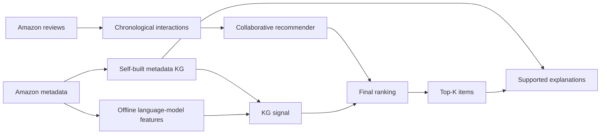
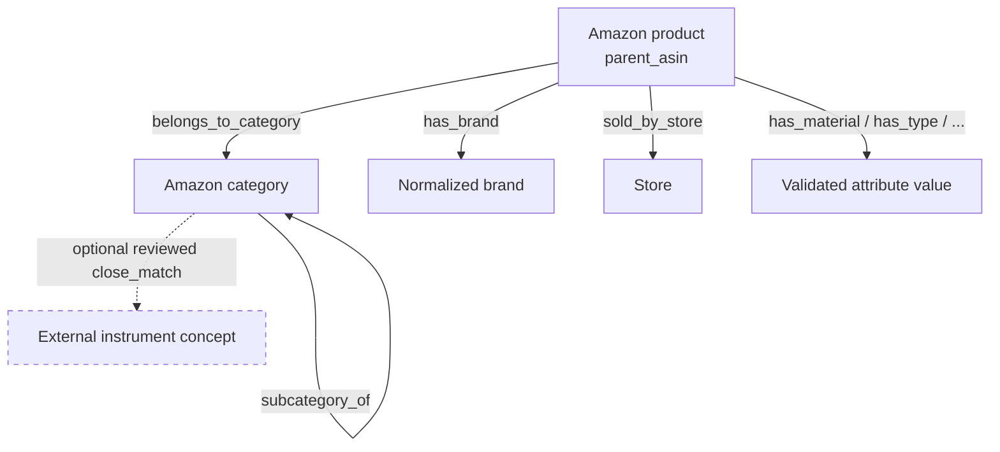
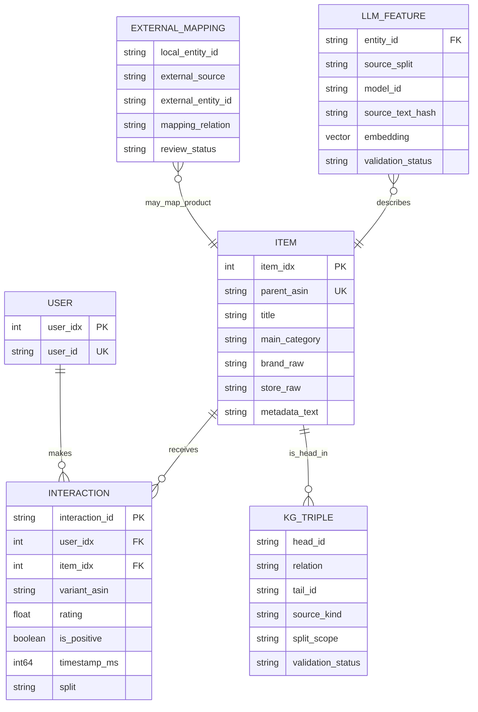
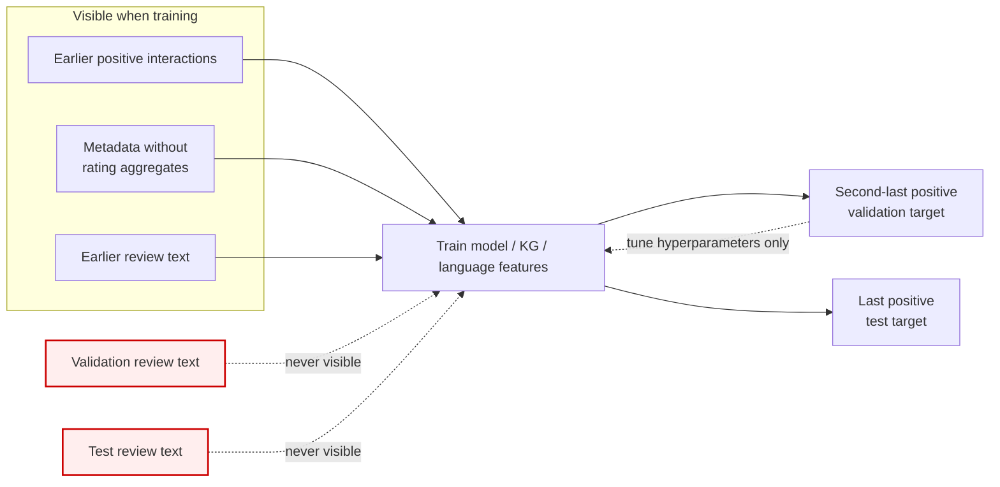
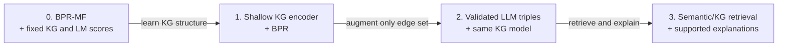

# Research Plan: LLMs and Knowledge Graphs for Recommendation

**Dataset:** Amazon Reviews 2023 — Musical Instruments  
**Project scale:** Student research prototype  
**Phase:** Research design only; no recommender has been implemented  
**Prepared:** 7 August 2026

This report uses `research_context.md` only as background. Dataset facts were checked against the McAuley Lab documentation, loader, benchmark-processing repository, and inspected release files. Claims from the background paper notes are not treated as verified facts unless linked to an original paper or official source below.

Evidence labels used throughout:

- **Verified—official:** stated by the dataset maintainers or another primary source.
- **Measured audit:** computed directly from the downloaded Musical Instruments files during this planning phase.
- **Estimate:** an engineering calculation whose assumptions are stated.
- **Assumption:** a proposed design choice, not a property of the data.
- **Unknown:** cannot be established reliably from the available documentation or files.

---


## 1. Executive summary

The dataset is suitable for a student-scale research project, provided the work begins with the official 5-core subset and uses the full 0-core data only after the pipeline is stable. It supports both explicit-rating prediction and implicit-feedback recommendation. The recommended primary task is implicit top-*K* ranking: treat ratings of 4 or 5 as positive interactions, split each eligible user's history chronologically, and evaluate whether the held-out item appears near the top of the recommendation list.

The raw release has the required users, products, ratings, timestamps, review text, product descriptions, categories, brand-like fields, images, and identifiers. `parent_asin` is the reliable join key between reviews and product metadata. A direct audit found 2,975,551 deduplicated 0-core interactions, 1,762,679 users, and 213,571 interacted items; all audited interaction items joined to the 213,593-row metadata file. The data is extremely sparse, however: about 75% of users have only one deduplicated interaction.

A pre-existing product-level external knowledge graph is **not feasible** as the main KG. An exact Wikidata ASIN join matched only one of 213,593 Amazon parent products. MusicBrainz contains musical concepts, artists, releases, and instrument types, but not reliable mappings for Amazon retail product families and accessories. DBpedia has the same basic entity-resolution problem. The recommended solution is therefore a **self-built metadata KG**, with reproducible relations from product categories, brand, and carefully normalized structured product details. A small hybrid extension may map only high-confidence Amazon category concepts to external instrument-type entities; those links must be labeled `close_match`, not asserted as product identity.

The project should contain exactly four staged architectures:

1. **Baseline:** BPR matrix factorization plus fixed self-built-KG similarity and offline language-model item embeddings.
2. **Improvement 1:** replace fixed KG similarity with a shallow trainable KG encoder while retaining offline language-model features.
3. **Improvement 2:** add only validated LLM-extracted attribute triples and compare collaborative-only, original-KG, and augmented-KG variants.
4. **Improvement 3:** add semantic/KG retrieval for candidate enrichment or reranking and produce explanations from verified graph paths; any online LLM paraphrasing remains optional and outside the main ranking experiment.




*Illustration 1. The minimum project logic: collaborative evidence determines what users tend to choose; metadata, the KG, and offline language features add semantic evidence.*

---


## 2. Feasibility verdict


### Verdict: pass, with a self-built KG and staged sampling

The stop condition is **not** triggered. A useful KG can be constructed from the selected Amazon dataset even though reliable ***external product linking is unavailable.***


| Requirement                   | Verdict           | Evidence and consequence                                                                                                      |
| ----------------------------- | ----------------- | ----------------------------------------------------------------------------------------------------------------------------- |
| Stable user identifiers       | Yes               | `user_id` is present in reviews and rating-only files. It is a pseudonymous account identifier, not a demographic profile.    |
| Stable item identifiers       | Yes               | `parent_asin` identifies the product family used in metadata and recommendation; `asin` identifies a reviewed variant.        |
| User–item interactions        | Yes               | A review/rating is an observed interaction. Absence of a review is unknown preference, not a confirmed dislike.               |
| Explicit ratings              | Yes               | `rating` is a 1.0–5.0 score. Explicit rating prediction is possible.                                                          |
| Implicit feedback             | Yes               | Ratings/reviews can be converted into positive events. The recommended threshold is `rating >= 4`.                            |
| Timestamps                    | Yes               | Millisecond Unix timestamps support chronological splitting. They indicate review time, not necessarily purchase time.        |
| Review text                   | Yes               | Raw reviews include review title and body. Use only training-period reviews in learned text features.                         |
| Product text                  | Yes               | Metadata includes title, features, description, categories, and structured details with substantial but incomplete coverage.  |
| Categories and brand          | Yes, noisy        | Categories are useful and structured; `details.Brand` and `store` are incomplete and sometimes disagree.                      |
| Images                        | Yes               | URLs are present for most metadata rows, but downloading or modeling images is outside the minimum project.                   |
| Reliable review–metadata join | Yes               | Use `parent_asin`; measured 0-core join coverage was 100%.                                                                    |
| External product KG           | No, as primary KG | Exact Wikidata ASIN coverage was 1/213,593; MusicBrainz and DBpedia do not solve retail-product mapping.                      |
| Self-built metadata KG        | Yes               | Category hierarchy, product-category, product-brand, and validated product-attribute relations are reproducible and relevant. |
| Student-scale computation     | Yes, staged       | Use 5-core first; cache language outputs; avoid processing all review text with a generative LLM.                             |


### Supported recommendation tasks

- **Primary: implicit-feedback ranking.** Predict a ranked list of unobserved items for each user. This matches common recommender evaluation and the proposed BPR objective.
- **Secondary: explicit-rating prediction.** Predict the numerical 1–5 rating, using RMSE or MAE. This is supported by the data but should not be mixed into the primary experiment because it answers a different question.
- **Not directly supported:** clicks, impressions, add-to-cart events, purchases without reviews, exposure logs, user demographics, session boundaries, or true negative preferences.


### Practicality

The full raw release is manageable for streaming preprocessing on a normal laptop or modest workstation, but repeated model training over 1.76 million users is inconvenient. The 5-core subset—approximately 57.4K users, 24.6K items, and 511.8K interactions according to the official page—is the appropriate main prototype. A deterministic smaller sample should be used for pipeline checks before the 5-core experiment. Scaling to an eligible 0-core cohort is a final robustness step, not the starting point.

---


## 3. Verified dataset facts and sources


### 3.1 Authoritative source index


| Source                                                                                                                                                        | What it verifies                                                                                                     |
| ------------------------------------------------------------------------------------------------------------------------------------------------------------- | -------------------------------------------------------------------------------------------------------------------- |
| [Amazon Reviews 2023 official documentation](https://amazon-reviews-2023.github.io/)                                                                          | Category statistics, raw review and metadata schemas, identifier meanings, and download links.                       |
| [Official Hugging Face loader](https://huggingface.co/datasets/McAuley-Lab/Amazon-Reviews-2023/blob/main/Amazon-Reviews-2023.py)                              | Configuration names, file paths, schemas, 0-core/5-core rating files, and benchmark split layouts.                   |
| [Official 0-core documentation](https://amazon-reviews-2023.github.io/data_processing/0core.html)                                                             | Deduplicated rating-only format and 0-core rationale/statistics.                                                     |
| [Official 5-core documentation](https://amazon-reviews-2023.github.io/data_processing/5core.html)                                                             | Iterative 5-core filtering and category-level subset statistics.                                                     |
| [Maintainer benchmark scripts](https://github.com/hyp1231/AmazonReviews2023/tree/main/benchmark_scripts)                                                      | Deduplication and standard split implementation.                                                                     |
| [Dataset paper](https://arxiv.org/abs/2403.03952)                                                                                                             | Research context and construction of the release.                                                                    |
| [Wikidata ASIN property P5749](https://www.wikidata.org/wiki/Property:P5749)                                                                                  | External identifier semantics and declared incompleteness.                                                           |
| [MusicBrainz instrument documentation](https://musicbrainz.org/doc/Instrument) and [database documentation](https://musicbrainz.org/doc/MusicBrainz_Database) | Scope and semantics of MusicBrainz entities.                                                                         |
| [DBpedia overview](https://www.dbpedia.org/about/)                                                                                                            | DBpedia's Wikipedia-derived scope.                                                                                   |
| [Maintainer license discussion](https://huggingface.co/datasets/McAuley-Lab/Amazon-Reviews-2023/discussions/1)                                                | The maintainers do not assign a standard dataset license; users remain responsible for legal and ethical compliance. |


### 3.2 Available Musical Instruments files

The following official configurations or logical files are available. Files may be obtained as compressed JSONL/CSV from the project site or as sharded Parquet through Hugging Face.


| Layer                     | Official configuration/path                                                                    | Format                                               | Purpose                                                                                                          |
| ------------------------- | ---------------------------------------------------------------------------------------------- | ---------------------------------------------------- | ---------------------------------------------------------------------------------------------------------------- |
| Raw reviews               | `raw_review_Musical_Instruments`; `raw/review_categories/Musical_Instruments.jsonl`            | JSONL, distributed compressed or as 3 Parquet shards | Full ratings, text, review images, variant and parent product IDs, users, timestamps, helpfulness, verification. |
| Raw product metadata      | `raw_meta_Musical_Instruments`; `raw/meta_categories/meta_Musical_Instruments.jsonl`           | JSONL, distributed compressed or as 2 Parquet shards | Product title, descriptive metadata, images, category hierarchy, details, and parent item ID.                    |
| 0-core rating-only        | `0core_rating_only_Musical_Instruments`; `benchmark/0core/rating_only/Musical_Instruments.csv` | CSV                                                  | Deduplicated `(user_id, parent_asin, rating, timestamp)` interactions without text.                              |
| 5-core rating-only        | `5core_rating_only_Musical_Instruments`; `benchmark/5core/rating_only/Musical_Instruments.csv` | CSV                                                  | Iteratively filtered users/items with at least five interactions.                                                |
| Standard benchmark splits | 0-core and 5-core variants of `last_out`, `last_out_w_his`, `timestamp`, and `timestamp_w_his` | Train/valid/test CSV                                 | Maintainer-provided reproducible benchmark splits.                                                               |


The main project requires raw metadata, raw reviews when text is used, and either the rating-only file or a locally reproduced interaction table. Keep original compressed files immutable and record their hashes.

### 3.3 Official category-scale statistics

**Verified—official:** the Musical Instruments row reports approximately 1.8 million users, 213.6K items, 3.0 million ratings, 182.2 million review tokens, and 200.1 million metadata tokens. The official site counts items from reviews and warns that some categories can contain reviewed items without metadata. That general warning did not materialize in the audited Musical Instruments 0-core join.

### 3.4 Measured file audit

The following figures were computed directly from the downloaded release rather than copied from documentation.

#### Files and integrity


| File               | Compressed size   | Decompressed size                  | SHA-256 when recorded                                              |
| ------------------ | ----------------- | ---------------------------------- | ------------------------------------------------------------------ |
| Raw reviews        | 458,632,324 bytes | Not retained after streaming audit | Not recorded in the final audit notes                              |
| Raw metadata       | 155,378,934 bytes | 631,877,970 bytes                  | `26a08fb09c39f9afc0982e7c101967df23a08ccdb0832657a3fe1af89e67c29d` |
| 0-core rating-only | 75,845,845 bytes  | 172,583,864 bytes                  | `042648a89f479aaa2af4664dcb49966dbaf07bd5ebab6957799f5fb4c5efa2e0` |
| 5-core rating-only | About 29.7 MB     | Not measured in the retained notes | Unknown                                                            |


Hugging Face reported 3,017,439 raw review rows across three Parquet shards (678,277,413 bytes download) and 213,593 metadata rows across two shards (230,624,103 bytes download). These raw-review counts are expected to exceed 0-core counts because 0-core deduplicates user–item pairs.

#### 0-core interaction audit


| Quantity                                                         | Measured value              |
| ---------------------------------------------------------------- | --------------------------- |
| Deduplicated interactions                                        | 2,975,551                   |
| Unique users                                                     | 1,762,679                   |
| Unique interacted `parent_asin` items                            | 213,571                     |
| Interaction rows joining to metadata                             | 2,975,551 (100%)            |
| Interacted items joining to metadata                             | 213,571 (100%)              |
| User–item density                                                | 0.000790409%                |
| Users with exactly one interaction                               | 1,319,442                   |
| Users with at least three interactions                           | 208,995                     |
| Users with at least three positive interactions at `rating >= 4` | 166,387                     |
| Earliest timestamp                                               | 1999-08-26 02:51:32 UTC     |
| Latest timestamp                                                 | 2023-09-12 19:25:04.987 UTC |


Rating distribution:


| Rating | Count     | Share interpretation                            |
| ------ | --------- | ----------------------------------------------- |
| 1      | 260,520   | Negative if a binary threshold is used          |
| 2      | 129,732   | Negative                                        |
| 3      | 194,567   | Neutral/ambiguous; exclude from positive events |
| 4      | 394,945   | Positive                                        |
| 5      | 1,995,787 | Positive                                        |


Ratings 4–5 total 2,390,732 interactions, or 80.3459% of 0-core events. This strong positive skew makes rating prediction possible but makes top-*K* implicit recommendation the clearer primary task.

#### Metadata audit

There are 213,593 rows and 213,593 unique `parent_asin` values.


| Field or derived property | Non-missing rows | Coverage | Notes                                                              |
| ------------------------- | ---------------- | -------- | ------------------------------------------------------------------ |
| `title`                   | 213,577          | 99.99%   | Excellent text anchor.                                             |
| `images`                  | 213,487          | 99.95%   | URLs only; image availability can change.                          |
| `details`                 | 210,339          | 98.48%   | Heterogeneous dictionary; keys need controlled normalization.      |
| `store`                   | 210,037          | 98.34%   | Seller/store-like string, not guaranteed to be manufacturer brand. |
| `main_category`           | 210,201          | 98.41%   | Broad Amazon domain, not the fine category path.                   |
| `categories`              | 194,619          | 91.12%   | Ordered category path.                                             |
| `features`                | 176,981          | 82.86%   | Bullet-point text.                                                 |
| `description`             | 152,734          | 71.51%   | List of text fragments.                                            |
| `details.Brand`           | 124,082          | 58.09%   | 17,817 unique raw strings before normalization.                    |
| `price`                   | 84,916           | 39.76%   | Crawl-time snapshot; 84,878 floats and 38 strings.                 |
| `videos`                  | 62,062           | 29.06%   | Outside the minimum experiment.                                    |
| `details.UPC`             | 161              | 0.08%    | Too sparse to support external linking.                            |
| `bought_together`         | 0                | 0%       | All null in this category; unusable.                               |


Additional measured facts:

- The category data contains 575 unique labels, 749 unique prefix/path nodes, 747 parent–child hierarchy edges, and 844,629 product-to-category assignments.
- 194,154 category paths begin with `Musical Instruments`; 18,974 rows have no category path, and 465 begin with `Instrument Accessories`.
- `main_category` is not a safe domain filter by itself: 183,052 rows say `Musical Instruments`, while other rows contain broader or apparently contaminated domains.
- `store` and `details.Brand` are both present on 124,052 rows; 3,936 of those pairs (3.17%) disagree even after case-folding. They must remain distinct fields.
- `subtitle` and `author` occur only in 391 rows. Nonempty coverage is 338 and 121 respectively; `author` is sometimes a dictionary for sheet music or books.


### 3.5 Storage, compute, and LLM-cost implications


| Workload                                                                         | Practical assessment                                                                                                          |
| -------------------------------------------------------------------------------- | ----------------------------------------------------------------------------------------------------------------------------- |
| Streaming JSONL/CSV preprocessing                                                | Feasible on CPU with chunked reads; do not load all raw review text into RAM.                                                 |
| 5-core BPR-MF                                                                    | Feasible on CPU; a modest GPU shortens repeated runs but is not required.                                                     |
| 5-core shallow graph model                                                       | Feasible on a single consumer GPU or careful sparse CPU implementation.                                                       |
| Full 0-core training                                                             | Feasible but slower and more memory intensive because of 1.76M user embeddings. Use only after successful 5-core experiments. |
| 5-core frozen 384-dimensional item embeddings                                    | **Estimate:** about 38 MB in float32 for 24.6K items.                                                                         |
| Embedding all 5-core items at 250 tokens/item                                    | **Estimate:** 6.15M input tokens.                                                                                             |
| Structured extraction for all 5-core items at 500 input + 100 output tokens/item | **Estimate:** 12.3M input and 2.46M output tokens.                                                                            |
| Structured extraction pilot for 2,000 items                                      | **Estimate:** 1.0M input and 0.2M output tokens.                                                                              |
| Generative processing of the full release                                        | Not recommended: official counts imply about 200.1M metadata tokens plus 182.2M review tokens before prompt overhead.         |


Actual monetary cost is **unknown** until a model and current price are selected. Compute token counts first, then multiply by the model's documented input/output rates. Cache every response by model ID, prompt hash, and source-text hash.

### 3.6 Legal and ethical constraint

The release does not carry a conventional license assigned by the maintainers. Their public response says the data is provided primarily for research and that users are responsible for legal and ethical compliance. This is not a license grant. Before publishing derived text, images, a redistributed sample, or a commercial system, obtain institutional guidance. For a thesis prototype, distribute scripts and file hashes rather than the Amazon content itself.

---


## 4. KG options and recommended KG strategy

A **knowledge graph (KG)** stores facts as directed triples: `(head entity, relation, tail entity)`. For example, `(product:B001, belongs_to_category, category:guitar_strings)`. Entities are nodes; relations are wtyped edges.

### 4.1 Option 1 — pre-existing external KG


#### Wikidata

Wikidata has an Amazon Standard Identification Number property, `P5749`, so exact ASIN matching is theoretically attractive. An official Wikidata SPARQL audit found 81,162 `P5749` statements, 80,904 distinct ASIN values, but only one exact intersection with the 213,593 Amazon `parent_asin` values: `B07HMF1G57`, the Teenage Engineering OP-Z entity. Coverage is therefore **1/213,593 = 0.00046818%**. The Wikidata property page itself marks expected completeness as “always incomplete.”

Approximate-title matching would increase apparent coverage but introduces severe ambiguity across product variants, bundles, model revisions, generic accessories, and seller-written titles. It is unsuitable as an automatic identity mapping.

#### MusicBrainz

MusicBrainz is authoritative for music-related entities such as artists, releases, recordings, works, and instrument concepts. It is not a retail product catalog. It currently models roughly one thousand instrument entities/types, while the Amazon category contains over 213K product families including cables, stands, replacement parts, books, and accessories. Release ASINs in MusicBrainz mostly concern recorded media, not retail instruments. Product-level coverage is therefore effectively unavailable without a separate manufacturer/model identifier source.

#### DBpedia

DBpedia extracts structured knowledge from Wikipedia. Well-known instrument models or manufacturers may exist, but Amazon product families generally do not, and there is no supplied Amazon-to-DBpedia mapping. Title matching has the same false-match problem as Wikidata.

#### External-KG decision


| Criterion                       | Assessment                                                                           |
| ------------------------------- | ------------------------------------------------------------------------------------ |
| Product entity-linking coverage | Unusable as a main KG; exact Wikidata coverage is 0.00046818%.                       |
| Ambiguity                       | High for title/model matching, especially accessories, bundles, and variants.        |
| Missingness                     | Extreme; UPC coverage in Amazon metadata is only 0.08%.                              |
| False-match risk                | High without manufacturer part number, GTIN/UPC, or manually reviewed model mapping. |
| Relation quality                | High for entities that genuinely exist, but almost no Amazon product coverage.       |
| Reproducibility                 | Exact identifier joins are reproducible; fuzzy-title thresholds are fragile.         |
| Complexity and cost             | Disproportionate to likely coverage.                                                 |
| Viability                       | **Not viable as the project's primary KG.**                                          |


### 4.2 Option 2 — self-built Amazon metadata KG

This is a KG constructed from the selected dataset, not an external KG. It can include:

- `(product, belongs_to_category, category)` from each ordered category path;
- `(category_child, subcategory_of, category_parent)` from path prefixes;
- `(product, has_brand, brand)` from a normalized, nonmissing `details.Brand`;
- `(product, sold_by_store, store)` from `store`, kept separate from brand;
- `(product, has_attribute_value, value)` through relation-specific edges such as `has_material`, `has_color`, `has_instrument_type`, or `has_connector_type`, but only for an approved whitelist of `details` keys;
- `(user, interacted_with, product)` from **training interactions only** when the unified recommendation graph requires user nodes.

The inverse relation `(product, reviewed_by, user)` is mechanically derivable from `interacted_with`; storing both directions as separate facts is unnecessary unless a graph library requires reverse edges. If it does, label generated reverse edges explicitly.


| Criterion           | Assessment                                                                                                                            |
| ------------------- | ------------------------------------------------------------------------------------------------------------------------------------- |
| Entity coverage     | Product nodes: 100% of metadata; category assignment: 91.12%; brand: 58.09%; details dictionary: 98.48%, though individual keys vary. |
| Ambiguity           | Low for product IDs and category paths; moderate for raw brand/store/attribute strings.                                               |
| Missingness         | Explicit and measurable; omit absent relations rather than connecting all missing values to one `UNKNOWN` node.                       |
| False-match risk    | Low for exact metadata facts; normalization can wrongly merge brands or attribute values if too aggressive.                           |
| Relation quality    | High for category hierarchy; moderate for brand/store; variable for free-form details.                                                |
| Reproducibility     | High if raw values, normalization rules, source field, code version, and file hashes are retained.                                    |
| Complexity and cost | Low to moderate; no paid API is required.                                                                                             |
| Viability           | **Viable and recommended.**                                                                                                           |


### 4.3 Option 3 — hybrid KG

A hybrid KG combines the Amazon metadata KG with manually or deterministically linked external concepts. The feasible version is narrow:

- retain every Amazon product as a local entity;
- construct all metadata relations locally;
- map a reviewed list of unambiguous Amazon category concepts, such as `Electric Guitars`, to MusicBrainz or Wikidata instrument-type concepts;
- use a relation such as `close_match` or `category_maps_to_concept`;
- never claim that an Amazon product `same_as` an external instrument entity unless an exact identifier proves it.

This can add trusted taxonomy context, such as broader instrument families, but it will not create reliable product-level external coverage.


| Criterion           | Assessment                                                                                                                                   |
| ------------------- | -------------------------------------------------------------------------------------------------------------------------------------------- |
| Coverage            | Potentially good for common instrument categories, poor for product identity and accessories. Must be measured after a mapping table exists. |
| Ambiguity           | Moderate: a retail category can mix instrument types, parts, and intended uses.                                                              |
| Missingness         | Expected for long-tail categories and accessories.                                                                                           |
| False-match risk    | Manageable only with manual review and non-identity relation labels.                                                                         |
| Relation quality    | High when the external concept and mapping are reviewed; otherwise unknown.                                                                  |
| Reproducibility     | Good if the external KG snapshot/revision, query, mapping table, and review decisions are versioned.                                         |
| Complexity and cost | Moderate; mostly manual validation rather than compute.                                                                                      |
| Viability           | **Viable only as an optional ablation after the self-built KG works.**                                                                       |


### 4.4 Recommended strategy

Use the **self-built metadata KG** for the main experiment. It has deterministic product identifiers, useful category coverage, adequate brand/detail coverage, low cost, and clear provenance. Add a small hybrid category-concept mapping only if time remains and only as a separately reported ablation.




*Illustration 2. Recommended KG. Solid edges are reproducible Amazon-derived facts. The dashed external concept mapping is optional and is not a product identity assertion.*

Limitations must be explicit: this graph represents Amazon catalog metadata and review interactions, not complete real-world musical knowledge. It inherits seller-written noise, missing fields, category contamination, and the 2023 crawl snapshot.

---


#### KG triple table


| Field               | Type                 | Meaning and treatment                                                            |
| ------------------- | -------------------- | -------------------------------------------------------------------------------- |
| `head_id`           | String               | Source entity ID with namespace, e.g. `item:B07...`.                             |
| `relation`          | Controlled string    | Typed edge such as `belongs_to_category`.                                        |
| `tail_id`           | String               | Target entity ID with namespace.                                                 |
| `source_kind`       | Enum                 | `amazon_metadata`, `train_interaction`, `external_mapping`, or `llm_extraction`. |
| `source_record_id`  | String               | Product, interaction, or mapping record providing provenance.                    |
| `evidence`          | Nullable string/JSON | Raw value or short supporting span; required for LLM triples.                    |
| `split_scope`       | Enum                 | `static_metadata`, `train_only`, or another explicit visibility scope.           |
| `confidence`        | Nullable float       | Mainly for generated/mapped triples.                                             |
| `validation_status` | Enum                 | `accepted`, `rejected`, `needs_review`.                                          |
| `pipeline_version`  | String               | Hash/version of normalization, prompt, and validation logic.                     |


#### Optional LLM/language-feature table


| Field               | Type                                          | Meaning and treatment                                                  |
| ------------------- | --------------------------------------------- | ---------------------------------------------------------------------- |
| `entity_id`         | String                                        | Usually canonical item ID.                                             |
| `source_split`      | Enum                                          | `static_metadata` or `train_only`; never validation/test review text.  |
| `model_id`          | String                                        | Exact model name and revision.                                         |
| `prompt_hash`       | String                                        | Empty/null for direct embedding; otherwise exact prompt-template hash. |
| `source_text_hash`  | String                                        | Detects stale outputs without redistributing source text.              |
| `summary`           | Nullable string                               | Cached generated summary, if used.                                     |
| `embedding`         | Fixed-length float vector or artifact pointer | Cached semantic representation.                                        |
| `structured_output` | Nullable JSON                                 | Parsed proposed triples/attributes.                                    |
| `validation_status` | Enum                                          | Whether structured output passed validation.                           |
| `created_at`        | UTC timestamp                                 | Audit only; not a model feature.                                       |


---


## 6. Data relationships and canonical schema


### 6.1 Conceptual relationships

- A **user** writes zero or more reviews.
- A raw review concerns one variant `asin` and one parent product `parent_asin`.
- The recommendation **item** is the parent product family.
- A review becomes one canonical **interaction** after user–parent deduplication.
- Product metadata joins to interactions through `parent_asin`.
- Product categories, brands, stores, and validated attributes become KG entities.
- A KG fact is a triple `(head, relation, tail)` with provenance.
- Optional external concepts are linked through a reviewed mapping table.
- Optional language-model outputs are cached by item, source visibility, model, prompt, and source hash.




*Illustration 3. Canonical relational view. KG tail entities are stored in the triple table/entity vocabulary even though the compact diagram emphasizes the item-facing joins.*

### 6.2 Minimal canonical tables


#### User table

- `user_idx`: contiguous integer for efficient modeling.
- `user_id`: original pseudonymous stable identifier.
- Optional audit-only counts computed **within training data**, such as `train_positive_count`.

Do not include demographics because the dataset provides none. Do not compute all-time activity counts as model features.

#### Item table

- `item_idx`, `parent_asin`.
- cleaned `title`, ordered `categories`, raw and normalized brand/store fields.
- whitelisted normalized details.
- `metadata_text` assembled from allowed non-target metadata.
- optional image pointer for future work.

Exclude crawl-time `average_rating` and `rating_number` from model-visible item data.

#### Interaction table

- deterministic `interaction_id`.
- `user_idx`, `item_idx`, `variant_asin`.
- raw `rating`, derived `is_positive`.
- `timestamp_ms`, UTC datetime, deterministic tie key.
- `split` (`train`, `validation`, `test`, or `ineligible`).
- optional pointers to split-aware review text.


#### KG triple table

- normalized, namespaced entity IDs.
- controlled relation type.
- provenance, split visibility, validation status, and pipeline version.


#### Optional external mapping and LLM tables

Keep external mappings and generated features separate from source tables so they can be removed cleanly in ablations.

### 6.3 Field use by project stage


| Use                          | Fields                                                                                                                                         |
| ---------------------------- | ---------------------------------------------------------------------------------------------------------------------------------------------- |
| Training interactions        | `user_id`, `parent_asin`, `rating`, `timestamp`; derived `is_positive`; training split only.                                                   |
| Validation/test interactions | Same four fields, held out chronologically and never exposed as graph edges.                                                                   |
| LLM/language-model input     | Product `title`, `categories`, `details.Brand`, whitelisted `details`, `features`, `description`; optional **training-only** review summaries. |
| Entity linking               | `parent_asin` for Wikidata exact ASIN attempts; validated `details.UPC`; normalized category label for manual concept mappings.                |
| Base KG construction         | `parent_asin`, ordered `categories`, `details.Brand`, `store`, approved `details` keys; training interactions only if user edges are included. |
| Explanations                 | Accepted KG triples and their provenance; no unsupported generated facts.                                                                      |


---


## 7. Preprocessing and leakage-prevention plan


### 7.1 Preprocessing sequence

1. **Freeze inputs.** Record download URL, retrieval date, byte size, SHA-256, and official configuration name. Keep compressed originals read-only.
2. **Stream and validate schemas.** Check required keys, value types, rating range, nonnegative timestamp/helpfulness, and JSON parse failures. Report rather than silently discard malformed rows.
3. **Normalize identifiers.** Preserve original strings; trim accidental whitespace only; never lowercase ASINs or user IDs; make deterministic integer maps sorted by original ID.
4. **Deduplicate interactions.** For each `(user_id, parent_asin)`, retain the earliest review to match official 0-core processing. For exact timestamp ties, choose the stable first raw-record index. Keep a duplicate-count audit table.
5. **Join metadata.** Join on `parent_asin`, report unmatched interactions and orphan metadata, and fail the reproducibility check if coverage differs unexpectedly from the audited release.
6. **Clean metadata conservatively.** Normalize Unicode/whitespace, preserve raw values, deduplicate exact repeated text, parse price safely, and keep brand separate from store.
7. **Create implicit labels.** Set `is_positive = 1` for ratings 4–5. Ratings 1–3 are observed nonpositive events used for masking and optional sensitivity analysis, not positive test targets.
8. **Determine eligibility before splitting.** Primary users need at least three positive interactions so each can contribute train, validation, and test positives. Decide the item universe from the training-visible catalog policy below.
9. **Split chronologically.** For each eligible user, last positive → test, second-last positive → validation, all earlier positives → training. Use `(timestamp_ms, tie_key)` ordering.
10. **Construct training graph.** User–item edges come only from training positives. Static metadata edges are allowed under the documented snapshot assumption. No validation/test review edges or text.
11. **Create language features.** Cache outputs. Metadata text is permitted after target aggregates are removed. Review-derived inputs are assembled only from training interactions.
12. **Fit transformations on training data.** Popularity, IDF weights, vocabularies, normalizers, projections, negative samplers, and hyperparameters must not use test outcomes.
13. **Freeze candidate sets and evaluate.** Mask every already-reviewed item for that user, including low-rated items, unless a separate repeat-recommendation experiment is declared.


### 7.2 Missing values and normalization

- Missing category, brand, or attribute means **no edge**. Do not connect all missing values to a shared `UNKNOWN` node; that creates an artificial popularity hub.
- Keep raw values beside normalized values. Normalize case and whitespace conservatively; maintain a reviewed alias table for brand merges.
- Do not infer `Brand = store`. Keep `has_brand` and `sold_by_store` separate.
- Category entity IDs should use the complete prefix path, not only the leaf label, because a label can occur under different parents.
- Whitelist detail relations only after measuring coverage, distinct-value count, type consistency, and a small manual precision sample.
- Do not impute price for the primary model. Missingness is too high and price is time-varying.


### 7.3 Review aggregation

If review text is added, aggregate only a user's/item's **training-visible** reviews. For an item embedding, prefer static product metadata in the baseline. For later review summaries, cap the number or total tokens per item, use a deterministic selection rule, and preserve whether each excerpt is verified-purchase. Never feed the held-out review's title, body, rating, or images into the representation used to predict that review.

### 7.4 Temporal leakage model




*Illustration 4. Leakage boundary. Validation outcomes tune choices, but validation/test review content and edges never enter training representations.*

One unavoidable limitation remains: product metadata is a 2023 crawl snapshot. A 2010 interaction may therefore be represented with text captured later. Removing `average_rating`, `rating_number`, and helpfulness reduces direct leakage, but it does not reconstruct historical metadata. Report this as a temporal-snapshot limitation and optionally run a recent-period sensitivity analysis.

### 7.5 KG and entity-linking validation

- Validate every node namespace and relation against a schema.
- Ensure each product head exists in the item table.
- Ensure each category hierarchy edge corresponds to adjacent values in an observed path.
- Measure raw-to-normalized collision rates for brand and attributes; inspect high-frequency merges.
- Require exact identifiers for product `exact_match` external links.
- Require two-person or at least repeated independent review for ambiguous category `close_match` links when possible.
- Store rejected mappings/triples as audit records but exclude them from model graphs.

---


## 8. Evaluation protocol and metrics


### 8.1 Primary protocol: chronological leave-two-out

For each user with at least three positive interactions (`rating >= 4`):

- latest positive item → test target;
- second-latest positive item → validation target;
- all earlier positive items → training history.

This user-level chronological split reflects the intended question: “given a user's past, can the system rank a later relevant item highly?” A random split is easier but can train on future preferences and should appear only as a clearly labeled sensitivity analysis, not the main result.

The official benchmark's leave-last-out split may be used for an external reproducibility comparison. The official benchmark scripts also expose fixed absolute timestamp cutoffs `1628643414042` and `1658002729837`; a global temporal split can be a secondary robustness test, but it creates more cold-start entities and a different user eligibility problem.

### 8.2 Repeated reviews and duplicate interactions

- Use one canonical event per `(user, parent item)` under the official earliest-event rule.
- Preserve variant ASIN and duplicate counts for audit.
- If two different parent products are near-duplicate catalog listings, do not merge them automatically; report this catalog-duplication limitation.
- At recommendation time, exclude all items the user has already reviewed, regardless of rating, for the standard new-item task.


### 8.3 Candidate set and negatives

An unobserved user–item pair is a **candidate negative**, not a verified dislike. The user may never have seen the product.

#### Primary: full-catalog evaluation

For each eligible user, rank the held-out positive against every eligible catalog item that was not previously reviewed by that user. This avoids sampled-negative instability and is practical for about 24.6K 5-core items with batched matrix operations.

Recommended warm-start catalog rule:

- every candidate item must have at least one training interaction;
- each evaluated user's held-out item must therefore be a training-known item;
- users whose held-out item is cold under this rule are excluded from the warm-start metric and counted in a separate cold-item report.


#### Secondary/dev-only: sampled negatives

If faster iteration is needed, sample a fixed number such as 100 or 1,000 unseen items per target, using a fixed seed and cached candidate file. Report sampled metrics as `sampled`; never compare them numerically with full-catalog results. Use full-catalog evaluation for final claims.

Training negatives for BPR should be drawn from items not in that user's training positives and preferably not in any of their observed reviewed items. Compare uniform sampling with popularity-aware sampling only if it becomes a research variable; otherwise fix uniform sampling.

### 8.4 Eligible users, items, and cold start


| Case                                     | Primary treatment                                        | Separate analysis                                                                                |
| ---------------------------------------- | -------------------------------------------------------- | ------------------------------------------------------------------------------------------------ |
| User has fewer than 3 positives          | Exclude from leave-two-out evaluation                    | Report count/share; optional one- or two-shot cold-user study.                                   |
| User unseen in training                  | Exclude from collaborative warm-start metrics            | Evaluate popularity/content fallback if desired.                                                 |
| Item unseen in training but has metadata | Exclude from warm-start primary metric                   | Evaluate content/KG cold-item ranking separately; this is where semantic features may help most. |
| Item missing metadata                    | Collaborative model may retain it if present in training | Exclude from KG/LLM-specific item comparisons or use explicit no-metadata indicator.             |
| User with only low ratings               | Not eligible for positive target                         | Retain items for “already reviewed” masking.                                                     |


Never mix warm-start and cold-start cases into one number without reporting their proportions.

### 8.5 Primary metrics

- **Recall@10 and Recall@20:** the fraction of held-out relevant items retrieved in the top 10 or 20. With one test item per user, this is the hit rate.
- **NDCG@10 and NDCG@20:** Normalized Discounted Cumulative Gain; rewards retrieving the held-out item and gives greater credit when it appears nearer the top. NDCG@10 is the primary selection metric.

Report the mean across users, results for at least three random seeds, and a paired user-level bootstrap 95% confidence interval for each improvement relative to its predecessor.

### 8.6 Secondary metrics


| Metric                           | Why it matters                                                                          | Caveat                                                                  |
| -------------------------------- | --------------------------------------------------------------------------------------- | ----------------------------------------------------------------------- |
| Precision@K                      | Share of top-*K* recommendations observed as relevant                                   | With one held-out item, `Precision@K = Recall@K / K`; less informative. |
| Catalog coverage@K               | Fraction of eligible items recommended to at least one user                             | High coverage alone does not mean relevance.                            |
| Novelty                          | Penalizes globally popular recommendations, often via self-information                  | Depends on training popularity definition.                              |
| Intra-list diversity             | Average dissimilarity among a user's top-*K* items using categories or semantic vectors | Define similarity before viewing test results.                          |
| Popularity bias                  | Compare recommendation popularity with user-history or catalog popularity               | Report distribution, not only one average.                              |
| Cold-item Recall/NDCG            | Measures value of KG/text when collaborative history is absent                          | Requires a deliberately constructed cold-item split.                    |
| Runtime, peak memory, model size | Tests student-scale practicality                                                        | Measure on named hardware and fixed candidate policy.                   |
| LLM tokens and cost              | Tests whether gains justify semantic processing                                         | Report cached and uncached costs separately.                            |


### 8.7 Three distinct validity questions

1. **Recommendation relevance:** Did offline interaction data mark the held-out item as relevant, and was it ranked in the top *K*? This is measured by Recall/NDCG.
2. **Explanation support:** Does each factual clause in an explanation correspond to an accepted KG path or source metadata value? This is measured by path support/faithfulness, not Recall.
3. **Generated fact validity:** Is an LLM-proposed triple parseable, nonduplicate, consistent with evidence, noncontradictory, and judged correct? This is measured by validation precision and human audit.

Good ranking does not prove a generated explanation is factual, and a factual explanation does not prove that it caused the recommendation.

### 8.8 LLM-output validation protocol

1. Require strict JSON matching a versioned schema and an allowed relation vocabulary.
2. Require the canonical product ID and an exact evidence span for each proposed triple.
3. Reject unparsable output, unknown relations, malformed values, absent evidence, and non-product heads.
4. Normalize values relation by relation; deduplicate exact and normalized triples.
5. Compare with existing KG facts; reject direct contradictions such as two mutually exclusive connector types when evidence does not support both.
6. Check type/range constraints and high-frequency suspicious outputs.
7. Human-review a stratified random sample of at least 200 proposed/accepted triples, including common and rare relations and rejected cases.
8. Target at least 90% precision among accepted triples before graph augmentation. Report a confidence interval and per-relation precision.
9. Version prompt, model, decoding settings, source hash, validator, and accepted/rejected output files.

Recall of the generated facts is generally **unknown** because there is no complete gold set. Do not claim high extraction recall without building an annotated reference sample.

---


## 9. Baseline architecture — minimal offline LLM + KG recommender


### 9.1 Objective and research question

Build the simplest valid hybrid recommender and test:

> **RQ0:** Do fixed metadata-KG similarity and offline language-model semantics improve chronological top-*K* ranking over collaborative BPR-MF?


### 9.2 Inputs and outputs

- **Inputs:** training positive interactions; self-built product-category and product-brand edges; allowed product metadata text.
- **Outputs:** a score for every eligible user–item pair and a top-*K* ranked list.


### 9.3 Data-engineering pipeline

1. Create the canonical train/validation/test split.
2. Build contiguous user/item ID maps.
3. Build a sparse item-feature matrix from category and normalized brand KG neighbors.
4. Assemble product text from `title`, categories, brand, features, and description after excluding rating aggregates.
5. Encode each item once with a frozen, version-pinned language model; cache vectors.
6. Train BPR-MF only on training positives and sampled unobserved items.
7. Tune two fusion weights on validation NDCG@10.


### 9.4 KG construction and use

The KG is the self-built metadata graph. In the baseline it is not passed through a trainable graph neural network. Convert each item neighborhood into a sparse category/brand vector. A user's KG preference vector is the mean of vectors for their training-positive items. `s_KG(u,i)` is cosine similarity between the user and candidate vectors.

### 9.5 LLM/language-model role

The language model runs offline only. It embeds the cleaned product text into one fixed vector per item; no user prompt and no online generation are required. A user's language vector is the mean of their training-positive item vectors. `s_LM(u,i)` is cosine similarity between the user and candidate item vectors.

Direct embedding is preferred to generated summaries in the minimum baseline because it is cheaper and deterministic. A generated-summary variant can be an ablation if the direct embeddings are too noisy.

### 9.6 Recommendation model and objective

BPR-MF learns one user vector `p_u` and item vector `q_i`. Its collaborative score is:

```text
s_CF(u, i) = p_u · q_i
```

Bayesian Personalized Ranking (BPR) optimizes a pairwise objective so a user's observed training item scores above a sampled unobserved item:

```text
L_BPR = -log sigmoid(s_CF(u, i_positive) - s_CF(u, i_negative)) + regularization
```

The final validation-tuned score is:

```text
s_0(u, i) = z_u(s_CF) + α z_u(s_KG) + β z_u(s_LM)
```

`z_u` standardizes each score family over the candidate items for one user so scale differences do not dominate. `α` and `β` are chosen on validation data and then frozen. The [original BPR paper](https://mlanthology.org/uai/2009/rendle2009uai-bpr/) is the primary method reference.

### 9.7 Inference flow

1. Retrieve all eligible unseen candidate items.
2. Compute matrix-factorization scores.
3. Compute fixed KG and language cosine similarities from the user's training history.
4. Standardize and combine the three score components.
5. Mask already reviewed items and return top *K*.


### 9.8 Benefits, risks, limitations, and cost

- **Benefits:** small, understandable, easy to ablate, no online LLM, and every signal has an explicit score contribution.
- **Risks:** fixed mean profiles may overemphasize broad categories; missing metadata gives weaker semantic scores; validation can overfit `α` and `β` if too many values are tried.
- **Limitations:** the KG is used as a feature graph rather than learned relational structure; BPR-MF cannot rank a truly new user; language semantics may reproduce catalog wording rather than preference.
- **Approximate cost:** low. BPR-MF is inexpensive; one cached 5-core item-embedding pass is roughly 6.15M processed tokens under the stated 250-token assumption and about 38 MB for 384-dimensional float32 vectors.
- **Change from previous architecture:** not applicable; this is the minimal baseline.

---


## 10. Three improvement architectures


### 10.1 Improvement 1 — KG-aware recommendation


#### Objective and research question

> **RQ1:** Does learning from typed metadata relations improve ranking beyond fixed KG-neighborhood similarity?


#### Inputs and outputs

- Baseline inputs plus the full accepted self-built KG triples.
- Item and user representations enriched by a shallow trainable KG encoder.
- Top-*K* scores in the same candidate universe as the baseline.


#### Pipeline, KG use, and LLM role

1. Retain the exact baseline split, item text, and cached language vectors.
2. Create node vocabularies for items, category-path nodes, brands, stores, and approved attribute values.
3. Create typed edges and reverse edges only where required by the graph library.
4. Encode the item-metadata KG with one or two R-GCN layers—a Relational Graph Convolutional Network shares parameters by relation type.
5. Combine the learned KG item vector with the collaborative item vector and fixed language vector through one linear projection.
6. Form a user semantic vector from training-positive enriched item vectors.
7. Train the fusion and recommender with BPR; select depth, dimension, and regularization on validation only.

The LLM remains offline and unchanged from the baseline. This isolates the contribution of learned KG structure.

#### Recommendation model and objective

Use BPR-MF as the collaborative backbone for the cleanest controlled comparison. Let `g_i` be the R-GCN item vector and `l_i` the fixed language vector:

```text
h_i = W [q_i || g_i || l_i]
h_u = W_u [p_u || mean_{j in train(u)} g_j || mean_{j in train(u)} l_j]
s_1(u, i) = h_u · h_i
```

Train with the same BPR loss and negative sampler. A LightGCN collaborative backbone may be a later ablation, not a simultaneous baseline change. [LightGCN](https://arxiv.org/abs/2002.02126) is relevant if that ablation is added; [PyTorch Geometric's R-GCN layer](https://pytorch-geometric.readthedocs.io/en/latest/generated/torch_geometric.nn.conv.RGCNConv.html) avoids a custom graph implementation.

#### Inference, change, benefits, risks, and cost

- **Inference:** precompute KG-aware item vectors, create each user vector from learned ID plus training history, score eligible candidates, mask reviewed items, return top *K*.
- **Change from Architecture 0:** replaces fixed KG cosine fusion with a trainable typed relation encoder; split, text vectors, BPR loss, and candidate policy stay fixed.
- **Benefits:** learns which relations and neighbor patterns are useful; propagates category/brand information to sparse items.
- **Risks:** noisy high-degree nodes, oversmoothing, memory use, and weak relation semantics. Cap layers at two and compare against shuffled-edge/no-KG controls.
- **Limitations:** still uses a crawl-time metadata graph and mean history aggregation; relation learning does not prove causal knowledge use.
- **Approximate cost:** low to moderate on the 5-core graph; likely a single consumer GPU or slower sparse CPU run. No additional LLM cost.


### 10.2 Improvement 2 — LLM-generated KG augmentation


#### Objective and research question

> **RQ2:** Do validated, evidence-backed LLM-extracted item attributes add recommendation value beyond the original self-built metadata KG?


#### Inputs and outputs

- Architecture 1 inputs and base KG.
- Product metadata plus, optionally, **training-only** review excerpts.
- Structured proposed triples with evidence and validation records.
- An augmented KG containing accepted triples only.
- Ranking results for collaborative-only, original-KG, and augmented-KG variants.


#### Data-engineering and extraction pipeline

1. Define a small allowed relation schema, for example `has_instrument_type`, `has_material`, `has_connector_type`, `compatible_with`, `intended_for`, and `has_skill_level` only where semantically clear.
2. Pilot 2,000 deterministic items spanning common/rare categories and metadata completeness levels.
3. Provide the LLM with canonical item ID and bounded metadata text; add review excerpts only from training interactions.
4. Require strict JSON triples and a verbatim supporting evidence span from the supplied text. Ask for “unknown/no triple” rather than guesses.
5. Apply the validation protocol in Section 8.8 and manually audit at least 200 examples.
6. Proceed beyond the pilot only if accepted-triple precision reaches 90% and useful relation coverage is nontrivial.
7. Add accepted triples as `source_kind = llm_extraction`; retain all rejected outputs outside the model graph.
8. Train Architecture 1 unchanged on each controlled graph variant.


#### KG and LLM roles

The base KG remains authoritative for copied metadata facts. The LLM is an offline information extractor, not an oracle: it proposes normalized structured facts from supplied evidence. It must not add unsupported world knowledge such as compatibility or manufacturer claims absent from the input. This design follows the research direction of [LLM graph augmentation for knowledge-aware recommendation](https://ceur-ws.org/Vol-4026/paper20.pdf) while adding stricter provenance and leakage controls.

#### Model, objective, inference, and required comparison

Use exactly the Architecture 1 R-GCN + BPR recommender, with identical hyperparameter search budgets:

1. **Collaborative-only:** no KG vectors; fixed language component reported separately.
2. **Original/self-built KG:** metadata triples only.
3. **LLM-augmented KG:** original KG plus accepted extracted triples.

At inference, no LLM call occurs. Item vectors are precomputed from the selected graph; ranking follows Architecture 1.

#### Change, benefits, risks, limitations, and cost

- **Change from Architecture 1:** only the KG edge set changes; recommender, split, candidates, training loss, and cached base text remain fixed.
- **Benefits:** can recover useful attributes buried in free text, increase coverage for sparse structured fields, and create explicit explanation paths.
- **Risks:** hallucinations, inconsistent normalization, relation imbalance, prompt/model drift, and test-review leakage. Evidence requirements and accepted-only graphs are mandatory.
- **Limitations:** human precision samples do not establish complete recall; generated edges may restate text embeddings rather than add new signal.
- **Approximate cost:** pilot ≈1.0M input +0.2M output tokens; complete 5-core extraction ≈12.3M input +2.46M output tokens under the stated assumptions. Monetary cost depends on the chosen model's current rates.


### 10.3 Improvement 3 — retrieval or reasoning enhancement


#### Objective and research question

> **RQ3:** Can KG/semantic retrieval improve ranking or explanation support beyond learned graph representations without requiring an online LLM?


#### Inputs and outputs

- Architecture 2's chosen accepted KG and trained recommender.
- Cached item language embeddings and KG neighborhoods.
- Retrieved semantically similar or graph-related items.
- Enriched candidate ranking plus a templated explanation with graph provenance.


#### Pipeline and retrieval use

1. Build an item-to-item similarity index from cached language vectors and/or KG representations.
2. For each user's training-positive history, retrieve top semantic neighbors and graph-neighborhood candidates.
3. Generate the normal top-*N* candidate set from Architecture 2.
4. Either union retrieved items into the candidate set or rerank the fixed candidate set. Keep these as separate experiments because candidate generation and reranking answer different questions.
5. Add validation-tuned features such as maximum history-item similarity and count/weight of supported KG paths.
6. Produce explanations from accepted paths, for example: “Recommended because it shares the category *Acoustic Guitar Strings* and brand *X* with items in your training history.”
7. Verify that every clause names an existing accepted path and expose the source relation IDs for audit.

At 24.6K items, exact batched cosine similarity is sufficient. Add [FAISS](https://github.com/facebookresearch/faiss) only if measured scaling makes exact retrieval too slow.

#### LLM role, model, and inference

No online LLM is needed for the main experiment. A simple reranking score is:

```text
s_3(u, i) = z_u(s_2) + γ z_u(max_semantic_similarity) + δ z_u(KG_path_support)
```

Tune `γ` and `δ` on validation data. An online LLM may paraphrase the already validated template after ranking, but it must be reported as a separate usability demonstration, never as part of relevance evaluation or fact generation.

This stage is a student-scale simplification of retrieval-oriented ideas in [CoLaKG](https://arxiv.org/abs/2410.12229). Dynamic graph architectures such as [DynLLM](https://arxiv.org/abs/2405.07580) are future work because their continuous-time modeling and online updates add complexity not required to answer this project's core questions.

#### Change, benefits, risks, limitations, latency, and cost

- **Change from Architecture 2:** adds retrieval features/candidates and graph-path explanations after model training; the accepted KG and base recommender remain fixed.
- **Benefits:** can surface semantically related long-tail items and gives auditable explanation paths.
- **Risks:** retrieval may reinforce textual near-duplicates, reduce diversity, or leak if the index contains test-review-derived vectors. Use only permitted item vectors and report duplicate/category concentration.
- **Limitations:** a graph path supports an explanation but does not prove why the user chose the item. Offline interactions do not measure explanation usefulness.
- **Latency:** exact 24.6K-item vector retrieval is likely milliseconds to low tens of milliseconds per batched user on suitable hardware, but this is an estimate and must be measured. Online LLM paraphrasing adds network/model latency, commonly much larger and variable.
- **Cost:** low for offline exact retrieval and templates. Optional online calls create recurring per-request cost and reduce reproducibility, so exclude them from the main system.

---


## 11. Architecture comparison table




*Illustration 5. Controlled progression. Each stage changes one main component so any gain has a plausible interpretation.*


| Architecture           | Research question                                                  | Recommender                                      | KG use                                            | LLM role                             | Main added cost                        | Critical ablation                                                                              |
| ---------------------- | ------------------------------------------------------------------ | ------------------------------------------------ | ------------------------------------------------- | ------------------------------------ | -------------------------------------- | ---------------------------------------------------------------------------------------------- |
| 0. Minimal baseline    | Do fixed KG and language signals beat collaborative BPR-MF?        | BPR-MF + validation-tuned score fusion           | Sparse category/brand neighborhood cosine         | Offline frozen item embedding        | One item-embedding pass                | CF only; KG only; LM only; CF+KG; CF+LM; all three                                             |
| 1. KG-aware            | Does learned typed KG structure beat fixed KG similarity?          | BPR-MF + shallow R-GCN fusion, BPR loss          | Trainable message passing over self-built triples | Same cached item vectors             | Sparse graph training                  | No KG; shuffled relations/edges; 1 vs 2 layers                                                 |
| 2. LLM-augmented KG    | Do validated extracted facts add value beyond base metadata?       | Same as Architecture 1                           | Base versus accepted augmented graph              | Offline structured triple extraction | LLM tokens + validation + human audit  | Collaborative-only vs base KG vs augmented KG; per-relation removal                            |
| 3. Retrieval/reasoning | Does semantic/KG retrieval improve ranking or explanation support? | Architecture 2 + simple reranker/candidate union | Retrieval and supported paths                     | Optional paraphrase only, separate   | Similarity index and inference latency | Ranking without retrieval; semantic-only vs KG-only retrieval; template vs optional paraphrase |


The staged design intentionally does not introduce dynamic graph transformers, multi-agent systems, a graph database, or a large online LLM pipeline. None is needed to test the four research questions.

---


## 12. Recommended implementation roadmap


### 12.1 Implementation order

1. **Approve the design and freeze task definitions.** Confirm positive threshold, warm-start catalog policy, and primary split before coding.
2. **Create the data manifest and audit.** Reproduce the counts, hashes, schema, joins, missingness, rating distribution, and timestamps in this report.
3. **Build canonical tables and split.** Add one invariant check: no user–item pair or held-out positive appears in training.
4. **Run non-neural baselines.** MostPopular, then BPR-MF. Validate full-catalog evaluation before adding semantics.
5. **Build the base metadata KG.** Start only with categories and `details.Brand`; add store/whitelisted details only after coverage and collision audits.
6. **Create cached offline item embeddings.** Start with 2,000 items, then all 5-core items.
7. **Run Architecture 0 and its score ablations.** This is the minimal viable experiment.
8. **Run Architecture 1.** Add a one-layer KG encoder; add a second layer only as an ablation.
9. **Pilot Architecture 2.** Stop extraction if parseability, coverage, or human precision is inadequate.
10. **Run Architecture 3.** Begin with fixed-catalog reranking; candidate union comes second.
11. **Scale once.** Repeat the most informative models on the eligible 0-core cohort or a globally temporal split.
12. **Write the final analysis.** Include uncertainty, cost, negative results, and limitations.


### 12.2 Minimal viable experiment

The MVP is complete when all of the following exist:

- deterministic 5-core canonical data and chronological leave-two-out split;
- MostPopular and BPR-MF baselines;
- self-built category + brand KG;
- one cached offline language embedding per eligible item;
- Architecture 0 with CF-only, CF+KG, CF+LM, and CF+KG+LM results;
- full-catalog Recall@10/20 and NDCG@10/20 across three seeds;
- runtime, peak memory, token count, and paired confidence intervals;
- a leakage audit proving validation/test review edges and text are absent.

If the MVP shows no semantic gain, that is still a valid result. Diagnose metadata coverage and score calibration before building the more expensive architectures.

### 12.3 Required baselines and ablations


#### Baselines

- MostPopular using training interaction counts only.
- BPR-MF collaborative-only.
- Optional collaborative LightGCN to check whether gains merely reflect a stronger interaction model.
- Content-only language similarity.
- KG-only neighborhood similarity.


#### Architecture 0 ablations

- CF only.
- KG only.
- LM only.
- CF + KG.
- CF + LM.
- CF + KG + LM.


#### Architecture 1 ablations

- no KG encoder;
- fixed KG baseline versus learned KG encoder;
- category-only versus category+brand versus approved full metadata KG;
- relation labels shuffled or KG edges shuffled while preserving comparable degree, as a sanity test;
- one versus two graph layers.


#### Architecture 2 ablations

- collaborative-only;
- original/self-built KG;
- LLM-augmented KG;
- metadata-only extraction versus metadata + training-review extraction;
- remove each generated relation family;
- accepted triples versus an equal-sized random/noisy-edge control.


#### Architecture 3 ablations

- no retrieval;
- semantic-only retrieval;
- KG-only retrieval;
- combined retrieval;
- reranking only versus candidate union;
- explanation template versus optional LLM paraphrase, evaluated for support separately from ranking.


### 12.4 Staged scale plan


| Stage                 | Data                                                                    | Purpose                                                          | Gate to continue                                                            |
| --------------------- | ----------------------------------------------------------------------- | ---------------------------------------------------------------- | --------------------------------------------------------------------------- |
| Smoke test            | Deterministic hash sample of 5,000 eligible users plus all needed items | Validate joins, split, negative masking, metrics, and caching    | Invariants pass; results repeat exactly.                                    |
| MVP                   | Full 5-core (~57.4K users, 24.6K items, 511.8K interactions)            | Main controlled architecture experiments                         | Three-seed metrics and resource use are stable.                             |
| LLM pilot             | 2,000 stratified 5-core items                                           | Measure parseability, coverage, precision, and actual token cost | ≥90% accepted-triple precision and useful coverage.                         |
| Full 5-core semantics | All eligible 5-core items                                               | Complete architectures 0–3                                       | Gain/cost criteria below are met or informative negative result documented. |
| Scale test            | Eligible 0-core cohort, not necessarily every user                      | Test robustness to sparsity and catalog scale                    | One or two selected models only; no full hyperparameter retuning on test.   |


Sampling must be deterministic by a published hash/seed, not “first N rows,” because source order may encode time or collection artifacts.

### 12.5 Criteria for genuine usefulness

An improvement is considered useful only if:

1. its paired 95% confidence interval versus the preceding architecture excludes zero on NDCG@10;
2. the direction is consistent across at least three seeds;
3. it achieves a predeclared practical threshold—recommended starting rule: at least 1% relative NDCG@10 improvement—without a material Recall@20 or catalog-coverage regression;
4. its gain survives the relevant ablations and a degree/noise sanity control;
5. generated triples, when used, achieve at least 90% audited precision;
6. runtime, memory, latency, and LLM cost remain acceptable for the student project;
7. the result does not depend on validation/test review content, target aggregates, or incompatible candidate sets.

If NDCG improves while diversity, coverage, or cold-item performance degrades, report the trade-off rather than declaring a universal improvement.

### 12.6 Recommended libraries

Prefer existing, standard tools:

- Python 3.11+ standard library for manifests, hashing, JSON, timestamps, and file paths.
- pandas or Polars for chunked tabular preprocessing; use whichever is already available.
- NumPy and SciPy sparse matrices for features and exact retrieval.
- PyTorch for BPR-MF and learned fusion.
- [PyTorch Geometric](https://pytorch-geometric.readthedocs.io/) for R-GCN/LightGCN layers if installed.
- [RecBole](https://recbole.io/docs/) only if its split and candidate semantics can be made identical to this protocol; otherwise a small transparent training loop is safer.
- scikit-learn for TF-IDF, normalization, and exact nearest-neighbor checks.
- sentence-transformers or another frozen, version-pinned embedding model for offline item vectors.
- Optional FAISS only after exact similarity is measured as too slow.

A graph database such as Neo4j is unnecessary at this scale; versioned edge tables and sparse tensors are sufficient.

### 12.7 Minimal project directory structure to create later

```text
project/
├── README.md
├── config.yaml
├── data/
│   ├── README.md
│   └── manifest.json
├── src/
│   ├── prepare.py
│   ├── run.py
│   └── evaluate.py
├── prompts/
│   ├── triples.md
│   └── triple.schema.json
├── artifacts/          # ignored; splits, IDs, KG, embeddings, checkpoints
└── results/
    └── metrics.csv
```

Do not create one module per architecture unless the shared `run.py` becomes genuinely difficult to understand. Reuse one split, evaluator, candidate set, and results schema.

### 12.8 Suggested results table


| Run ID       | Architecture | Data stage | Graph variant | Text variant | Seed | Recall@10 | Recall@20 | NDCG@10 | NDCG@20 | Coverage@10 | Cold NDCG@10 | Train time | Eval time | Peak memory | LLM input/output tokens | Estimated cost |
| ------------ | ------------ | ---------- | ------------- | ------------ | ---- | --------- | --------- | ------- | ------- | ----------- | ------------ | ---------- | --------- | ----------- | ----------------------- | -------------- |
| Example only | BPR-MF       | 5-core     | none          | none         | 1    | —         | —         | —       | —       | —           | —            | —          | —         | —           | 0/0                     | 0              |


Store per-user predictions or ranks for paired bootstrap analysis, but do not commit large artifacts to source control.

### 12.9 Artifacts to create only after design approval

- immutable data manifest and download instructions;
- audit report and canonical schema contract;
- deterministic ID maps and split files;
- KG relation schema, normalizers, and triple files;
- leakage/invariant checks;
- cached language embeddings and their model cards/hashes;
- training/evaluation configuration;
- LLM prompt, JSON schema, raw responses, validator outputs, and human annotation form;
- experiment registry/results table;
- final model card and limitations statement.

No implementation artifact should be produced before the task, split, candidate policy, and KG relation schema are approved.

---


## 13. Risks, limitations, and open questions


### 13.1 Expected failure modes and mitigations


| Failure mode                                | Why it may occur                                                                    | Mitigation / diagnostic                                                                                      |
| ------------------------------------------- | ----------------------------------------------------------------------------------- | ------------------------------------------------------------------------------------------------------------ |
| Popularity baseline is hard to beat         | Ratings are strongly positive and popularity-skewed                                 | Report MostPopular; inspect gains by item-popularity decile.                                                 |
| Most users are unusable for leave-two-out   | 1,319,442 users have one deduplicated event                                         | Use 5-core/eligible cohort and report excluded-user share; do not overgeneralize.                            |
| Metadata KG adds little                     | Categories may be broad and already correlated with item IDs                        | Category/brand ablations, shuffled-edge control, cold-item analysis.                                         |
| Brand graph is noisy                        | Brand is missing for 41.91%; raw aliases vary                                       | Conservative normalization, alias audit, no automatic store substitution.                                    |
| KG popularity hubs dominate                 | Broad categories connect to many products                                           | Use path-specific category nodes, normalize messages by degree, cap graph depth.                             |
| Text embeddings duplicate KG features       | Product text repeats category/brand values                                          | Run CF+KG and CF+LM ablations; remove category/brand tokens in a sensitivity run.                            |
| LLM triples hallucinate                     | Generative models infer plausible but unsupported attributes                        | Evidence spans, strict schema, accepted-only graph, ≥200 human audit sample, ≥90% precision gate.            |
| LLM outputs are non-reproducible            | Hosted models and prompts change                                                    | Pin model revision/settings, cache outputs, hash prompts/source, use deterministic decoding where supported. |
| Temporal leakage                            | Held-out review text, aggregate ratings, or helpful votes reflect the target/future | Train-only review inputs; drop aggregates; exclude helpful votes; automated graph/text split audits.         |
| Metadata snapshot leakage remains           | 2023 text represents older interactions                                             | State limitation; run recent-period sensitivity analysis if time permits.                                    |
| Evaluation is inflated by sampled negatives | Easier candidate sets increase metrics                                              | Use full catalog for final results; label and cache sampled dev sets.                                        |
| External mapping produces false identity    | Retail titles are ambiguous                                                         | Exact IDs for products; reviewed category `close_match` only; never fuzzy `same_as`.                         |
| Retrieval returns near-duplicate products   | Catalog titles and variants are repetitive                                          | Duplicate-title audit, category concentration/diversity metrics, optional dedup grouping analysis.           |
| Images/URLs disappear                       | Remote Amazon assets change                                                         | Exclude images from MVP; do not require network during evaluation.                                           |
| Dataset use is legally unclear              | No conventional license is assigned                                                 | Seek institutional guidance; distribute code/hashes, not content.                                            |


### 13.2 General limitations

- Reviews are selected feedback from users willing to review; they are not a representative exposure log.
- Noninteraction is not dislike, so offline negatives are uncertain.
- `user_id` has no demographics or stable real-world identity guarantees.
- Review timestamps are not purchase timestamps.
- The self-built KG captures catalog semantics, not a complete musical-instrument ontology.
- Categories, brand, store, descriptions, and details are seller/platform data and may be wrong or outdated.
- Offline relevance measures observed future reviews, not user satisfaction, business value, causal impact, or explanation usefulness.
- Results on a dense 5-core cohort may not generalize to the full long-tail catalog/user population.


### 13.3 Open questions to resolve before implementation

1. Will the thesis use the official 5-core split for comparability, the proposed positive-only chronological split for methodological clarity, or report both? **Recommendation:** proposed split primary, official split secondary.
2. Should 3-star ratings count as negative during BPR sampling or only as “already reviewed” masks? **Recommendation:** mask them but do not use them as verified negatives; test an explicit-negative sensitivity run later.
3. Which approved `details` relations have enough coverage and type consistency? This requires a key-frequency/type audit before the KG schema is frozen.
4. Which offline embedding model satisfies language, hardware, redistribution, and licensing constraints? Record model revision and embedding dimension after selection.
5. Is the optional hybrid category mapping worth the manual work? Add it only after base-KG results justify deeper taxonomy context.
6. What hardware and maximum API budget are available? These determine batch sizes and whether complete LLM extraction is sensible.
7. Does institutional policy permit storing raw text and remotely hosted image URLs? Resolve before sharing artifacts.

---


## 14. Reproducibility checklist


### Data and provenance

- [ ] Record dataset page, exact URLs/configurations, retrieval date, sizes, and SHA-256 hashes.
- [ ] Do not redistribute raw Amazon data without authorization.
- [ ] Record raw, 0-core, 5-core, and metadata row/user/item counts.
- [ ] Verify `parent_asin` uniqueness in metadata and interaction join coverage.
- [ ] Version every schema and normalization rule.
- [ ] Preserve raw values beside normalized IDs/attributes.


### Preprocessing and split

- [ ] Document the earliest-event user–parent deduplication rule and tie-break.
- [ ] Freeze the rating-to-positive threshold before experiments.
- [ ] Publish eligible-user/item definitions and excluded counts.
- [ ] Save deterministic ID maps and split membership.
- [ ] Assert no duplicate `(user,item)` remains.
- [ ] Assert validation/test positives and their review text are absent from training edges/prompts/embeddings.
- [ ] Exclude `average_rating`, `rating_number`, and `helpful_vote` from primary model inputs.
- [ ] Record candidate masking and cold-start policies.


### KG and external mappings

- [ ] Version entity namespaces, relation vocabulary, and type constraints.
- [ ] Store source field/record and split scope for every triple.
- [ ] Report per-relation edge counts, node degrees, missingness, and normalization collision rates.
- [ ] Require exact identifiers for external product identity.
- [ ] Store external source revision/query and reviewed mapping decisions.
- [ ] Keep base, hybrid, and LLM-augmented graphs as separate immutable artifacts.


### LLM/language features

- [ ] Record model/provider, model revision, decoding settings, prompt, and software version.
- [ ] Hash prompt templates and source text.
- [ ] Cache raw and parsed outputs without exposing prohibited source content.
- [ ] Record token counts, retries, parse failures, latency, and actual/estimated cost.
- [ ] Validate duplicates, evidence, type constraints, contradictions, and KG support.
- [ ] Publish human-sampling method, annotation instructions, agreement if multiple reviewers, and confidence interval.
- [ ] Keep online paraphrasing outside ranking metrics.


### Training and evaluation

- [ ] Fix and report random seeds, package versions, operating system, CPU/GPU, RAM/VRAM.
- [ ] Use the same split, candidates, negative policy, and search budget across compared models.
- [ ] Report MostPopular, BPR-MF, component baselines, and required ablations.
- [ ] Report full-catalog Recall@10/20 and NDCG@10/20 for at least three seeds.
- [ ] Report paired confidence intervals and the predeclared usefulness threshold.
- [ ] Separate warm-start, cold-item, and cold-user results.
- [ ] Record training/evaluation time, peak memory, model size, and retrieval latency.
- [ ] Save configurations, per-user ranks, and one tidy results table.


### Reporting

- [ ] Distinguish official facts, measured facts, estimates, assumptions, and unknowns.
- [ ] Report negative results and failed LLM validation gates.
- [ ] State the metadata snapshot, selection, sparsity, exposure, and licensing limitations.
- [ ] Avoid claiming that offline relevance proves user satisfaction or that KG support proves causality.

---


## 15. Beginner glossary


| Term                       | Plain-language definition                                                                                                                                      |
| -------------------------- | -------------------------------------------------------------------------------------------------------------------------------------------------------------- |
| Ablation                   | An experiment that removes or changes one component to test whether that component actually caused an improvement.                                             |
| ASIN                       | Amazon Standard Identification Number. Here, `asin` is a product variant ID and `parent_asin` groups related variants into the recommendation item.            |
| BPR                        | Bayesian Personalized Ranking, a training method that teaches a model to score an observed item above an unobserved item for the same user.                    |
| Candidate item             | An item the recommender is allowed to rank for a user.                                                                                                         |
| Canonical schema           | The single cleaned, consistent table design used by all models after raw files are normalized.                                                                 |
| Cold-start item/user       | An item or user with no training interactions. Collaborative models cannot learn a normal ID embedding for them.                                               |
| Collaborative filtering    | Recommendation from patterns of user–item interactions, without needing item meaning.                                                                          |
| Confidence interval        | A range expressing uncertainty in an estimated metric or difference.                                                                                           |
| Cosine similarity          | A measure of the angle between two vectors; often used to compare semantic embeddings regardless of vector magnitude.                                          |
| Data leakage               | Information from validation/test or the future entering training, making evaluation unrealistically easy.                                                      |
| Deduplication              | Reducing repeated records for the same logical event or user–item pair to one canonical record.                                                                |
| Embedding                  | A dense vector of numbers representing a user, item, or text so similar objects can be placed near each other mathematically.                                  |
| Entity                     | A KG node representing something identifiable, such as a product, category, brand, or instrument concept.                                                      |
| Entity linking             | Mapping a local entity to a corresponding entity in another database or KG.                                                                                    |
| Explicit feedback          | A directly stated preference, such as a 1–5 rating.                                                                                                            |
| Full-catalog evaluation    | Ranking a test item against the complete eligible catalog rather than a small negative sample.                                                                 |
| Graph neural network (GNN) | A model that updates node vectors by aggregating information from connected neighbors.                                                                         |
| Hallucination              | Plausible-sounding content generated by an LLM that is unsupported or false.                                                                                   |
| Hybrid KG                  | A graph that combines locally constructed Amazon facts with reviewed links to external knowledge.                                                              |
| Implicit feedback          | An action treated as evidence of interest, such as a review or high rating, even though it is not a direct binary “like.”                                      |
| Interaction                | An observed user–item event. In this dataset, a rating/review becomes an interaction.                                                                          |
| Item                       | The object being recommended; this project uses the `parent_asin` product family.                                                                              |
| Knowledge graph (KG)       | A graph of entities connected by named relations.                                                                                                              |
| KG triple                  | A fact represented as `(head entity, relation, tail entity)`.                                                                                                  |
| Language model / LLM       | A model trained on text. Here it is used offline to create product embeddings or propose structured attributes, not to make the primary recommendation online. |
| LightGCN                   | A simplified graph recommender that propagates user and item embeddings over the interaction graph.                                                            |
| Matrix factorization (MF)  | A collaborative method that learns compact user and item vectors whose dot product gives a preference score.                                                   |
| NDCG@K                     | A ranking metric that rewards relevant items in the top *K*, with more credit for higher positions.                                                            |
| Negative sampling          | Selecting unobserved items to act as training/evaluation alternatives; they are not necessarily true dislikes.                                                 |
| Node degree                | The number of graph edges connected to a node.                                                                                                                 |
| Offline evaluation         | Testing on historical held-out data rather than serving recommendations to live users.                                                                         |
| Parseability               | Whether generated structured output can be read automatically according to the required schema.                                                                |
| Precision@K                | The fraction of the first *K* recommendations that are labeled relevant.                                                                                       |
| Provenance                 | A record of where a fact, feature, or triple came from and how it was produced.                                                                                |
| R-GCN                      | Relational Graph Convolutional Network, a GNN that uses relation types when passing messages.                                                                  |
| Recall@K                   | The fraction of relevant held-out items found within the first *K* recommendations.                                                                            |
| Reranking                  | Reordering a candidate list using additional signals after an initial recommender produces scores.                                                             |
| Retrieval                  | Finding items or graph neighborhoods similar to a query vector or history.                                                                                     |
| Self-built KG              | A knowledge graph constructed from the selected Amazon dataset rather than downloaded as an existing external product KG.                                      |
| Sparsity                   | The condition where only a tiny fraction of all possible user–item pairs have interactions.                                                                    |
| Temporal split             | A split that trains on earlier events and evaluates on later events.                                                                                           |
| Top-*K* recommendation     | Returning the *K* highest-scoring candidate items for a user.                                                                                                  |
| Validation set             | Held-out data used to choose model settings, not to report final performance.                                                                                  |
| Warm start                 | Evaluation where users and items already have training interactions.                                                                                           |


---

**Planning conclusion:** proceed with a self-built metadata KG, a 5-core chronological implicit-feedback MVP, and the four controlled architectures above. Defer full 0-core scale, hybrid external mappings, review-image modeling, dynamic graph models, and online LLM reasoning until the minimum experiment demonstrates a measurable need.